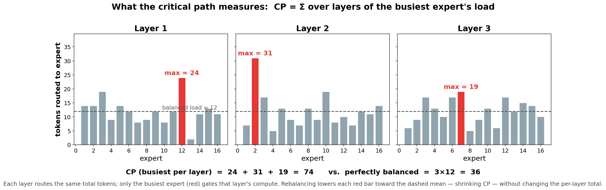
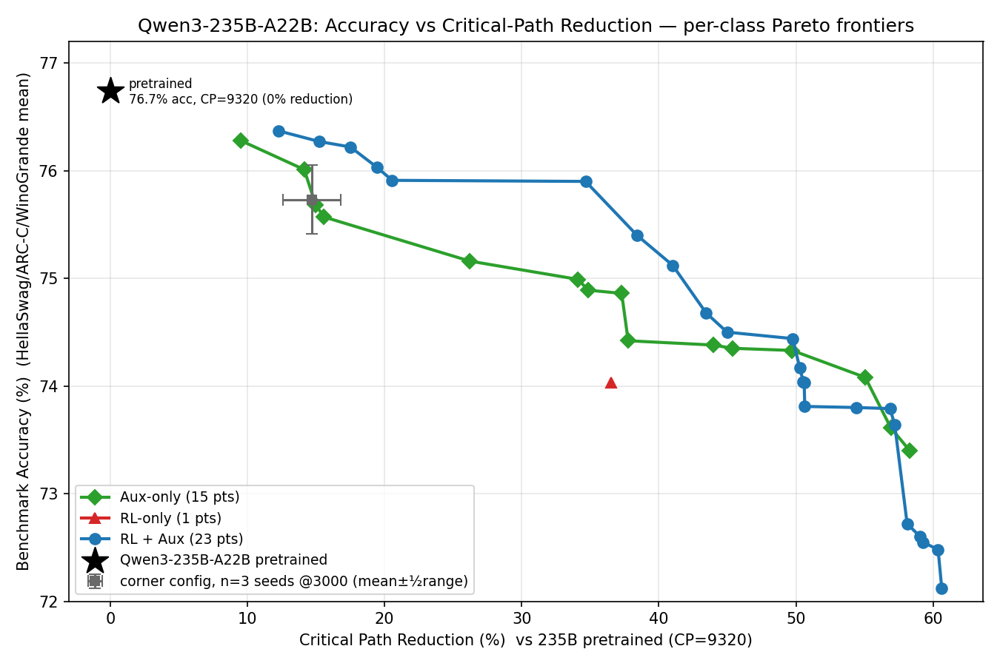
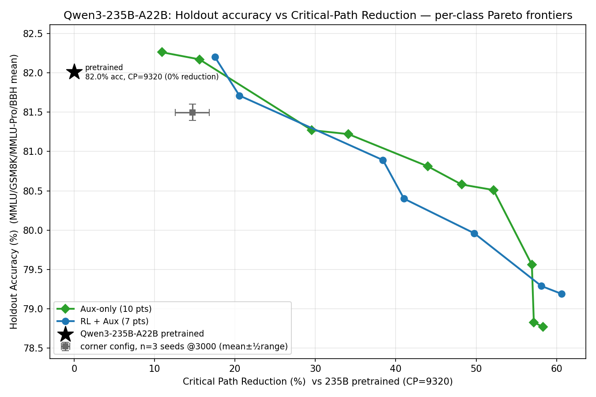

# Router-Only RL for MoE Load Balancing

## TL;DR
**Problem.** In Mixture-of-Experts (MoE) models, each token is routed to a few of many experts per layer, but routing is uneven: a handful of experts get overloaded every layer. The classic fix, an auxiliary load-balancing loss, directly optimizes a balance (entropy-like, uniform-load) term. The problem is that it targets *average* balance, not the *worst-case* busiest expert that drives latency, and tends to trade away model quality.

**Objective.** Produce a **drop-in, better-balanced router** for an *already-pretrained* MoE: improve the accuracy-vs-load-balance trade-off **without** changing the architecture, the standard top-k routing interface, or the (frozen) LM weights.

**Method.** Freeze the whole model and train **only the router weights** (<1% of params) with PPO. Each token's sequence of per-layer routing decisions is treated as a trajectory, optimized against a dense load-aware reward built from the **critical path (CP)**, the summed busiest-expert load across layers (defined below).

**Results.** On Qwen3-235B-A22B, router-only RL (+aux) **matches the aux-loss baseline through ~52% CP reduction and extends the frontier beyond it** — to ~61% CP reduction at ~3.4pp holdout cost (96.6% retention). Selection uses lm-evaluation-harness (HellaSwag, ARC-Challenge, WinoGrande); headline numbers are reported on a never-selected model-card holdout suite (MMLU, GSM8K, MMLU-Pro, BBH), where both methods are lossless at ≤17.5% reduction.


## Motivation & Problem Setup
MoE inference cost at scale is governed not by average expert load but by the *busiest* expert in each layer: with expert parallelism, a layer's FFN step waits on the most-loaded expert. We make this concrete with the **critical path (CP)** metric (next section). Existing balancing either changes the architecture/training objective (aux loss, loss-free bias, Expert/BASE/Sinkhorn routing) or the serving stack (capacity, EPLB, kernels). Our method instead does a *lightweight finetune of only the router* of an already-pretrained top-k MoE, leaving the LM weights and the standard top-k interface untouched, so the result is a drop-in checkpoint, not a new architecture or a runtime dependency.

## Critical Path (CP)
We define the **critical path** of a forward pass as the sum, over MoE layers, of the token count routed to the busiest expert in that layer:

```
CP = Σ_layers  max_e (tokens assigned to expert e)
```




**Figure 1. What CP measures.** Per-expert token histograms for three example MoE layers (illustrative). In each layer the busiest expert (red), not the mean (dashed), gates that layer's compute, and CP is the sum of those per-layer maxima. Because every layer routes the same total tokens, rebalancing lowers each red bar toward the mean (shrinking CP) without changing the work done.


**Figure 2. Systems view.** CP as a hardware timeline, before vs. after rebalancing. Each MoE layer's GPUs run in parallel, but the layer barrier (dashed) waits on the busiest expert while the rest sit idle (hatched). Top: skewed routing gives CP = 40+52+44 = 136. Bottom: rebalancing the same per-layer token totals lowers every maximum to CP = 82 (≈40% less) — the timeline ends sooner and idle nearly disappears, cutting inference latency proportionally.


**Figure 3. Dataflow view.** CP along the token path. Tokens are gated and dispatched (all-to-all) to experts spread across GPUs, processed, then combined and passed to the next layer; arrow thickness reflects token volume. The heaviest expert per layer (shaded, bold path) throttles its layer's dispatch–compute–combine, and these bottlenecks chain into the critical path. Flattening the routed volume thins the bold path and lowers end-to-end latency.

Figures 2 and 3 give two complementary views of the same effect: Figure 2 as a hardware timeline (where idle time comes from), Figure 3 as a dataflow path (where the token volume bottlenecks).

## RL, Aux-Only, and RL+Aux
Aux-only uses the standard Switch-Transformer-style MoE auxiliary loss. It is smooth and differentiable: it multiplies each expert's mean router probability by the fraction of tokens actually routed to it, summed over experts and weighted by a single coefficient — a quantity minimized when load is uniform. It encourages balanced routing, but it optimizes that balance surrogate rather than the critical path directly.

RL-only optimizes the load-aware reward directly. It can target critical path more naturally than aux loss, because the reward is defined from the loads actually produced by routing decisions. Its weakness is that it has no smooth differentiable load-balancing floor and no explicit quality guard beyond frozen LM weights and benchmark selection.

RL+aux combines the two: aux supplies a stable smooth gradient, while RL pushes against the actual load objective. On the **235B selection-suite frontier, RL+aux is the dominant variant**: it accounts for nearly all non-dominated points across the full ~6%→~61% CP-reduction range (on the unbiased holdout suite the picture is parity through ~52% plus an RL-only-reachable deep end — see R1b/R2). The 30B reference frontier shows the same pattern. RL-only is useful as an ablation and does appear on the high-accuracy frontier, but RL+aux is the practical default.

## Method: PPO formulation & reward design
**Trajectory.** For each token, its routing decisions across the `L` MoE layers form a length-`L` trajectory `(s_ℓ, a_ℓ, r_ℓ)`:

- **State** `s_ℓ`: the token's hidden representation entering layer `ℓ`'s router (i.e. the gating-network input at that layer).
- **Action** `a_ℓ`: the top-k expert selection for that token at layer `ℓ` (k of the 128 experts).
- **Policy** `π_θ`: the per-layer router / gating network — the *only* trainable parameters (<1% of model weights); the LM (experts, attention, embeddings, head) is frozen.
- **Reward** `r_ℓ`: the dense load-aware signal computed from the loads those choices actually produce (e.g. the token's contribution to the busiest-expert / critical-path load at layer `ℓ`).

**Baselines & discounting.** We compare a REINFORCE **mean baseline** against a **learned critic** (value head), with an optional discount factor γ and a **KL-to-reference** term that anchors the router to its pretrained behavior.

**Reward variants** (ablated): a smooth per-token load penalty, a direct critical-path penalty, a top-N-expert load penalty, and entropy shaping. The main design axes we sweep are the relative weights of the RL, aux, and KL terms; the discount factor γ; the baseline type (mean vs. critic); and the reward variant.

## Competing and Complementary Methods
MoE load balancing methods split into training-time approaches, which change the learned router or training objective, and test-time approaches, which leave the checkpoint fixed and change serving behavior.

Training-time competitors include:

- Auxiliary load-balancing loss: the standard baseline. It is stable and differentiable and directly optimizes a balance (entropy-like, uniform-load) term, but it targets *average* balance via a soft-probability surrogate rather than the worst-case busiest expert (the critical path).
- Loss-free balancing / expert bias (DeepSeek-style): dynamically biases expert scores up or down based on recent load. It avoids aux-loss gradient interference, but depends on a runtime feedback mechanism and must be checked for checkpoint portability.
- Expert Choice, BASE, Sinkhorn / optimal-transport routing: enforce or approximate balanced assignments by changing the routing rule itself. These can be strong load-balancing mechanisms, but they are architectural changes, not lightweight finetunes of a pretrained top-k router.

Test-time methods include capacity limits, token dropping/rerouting, EPLB (expert-parallel load balancing) using expert replication, and systems kernels such as MegaBlocks or Tutel. These mitigate runtime imbalance without retraining: capacity limits bound how many tokens an expert may process; EPLB places or replicates experts so hot experts do not overload the same device. They are complementary to our router-only RL method. Runtime systems reduce the cost of residual imbalance; router-only RL reduces the imbalance produced by the router in the first place while preserving the standard top-k MoE interface.

## Models & Experimental Setup
Qwen3-235B-A22B (primary) and Qwen3-30B (reference). The 235B experiments run at expert-parallel degree EP=16.

## Training Data
Training uses a pre-tokenized general-text corpus at short sequence length (128) with a small global batch. Because only the router updates and the LM contributes no gradient, a run reaches a usable router in ~1500 iterations (~1.5M tokens) — far below what full finetuning would need. The short sequence length and small batch are deliberate methodology constants chosen for cheap router adaptation (see Limitations), not tuned serving settings.

## Evaluation
Checkpoints are evaluated with lm-evaluation-harness on three tasks — HellaSwag, ARC-Challenge, and WinoGrande — at each task's default few-shot setting; we report the unweighted mean of the three accuracies.

Each evaluated checkpoint is recorded together with its critical path, so every result is an `(accuracy, CP)` pair — the two axes of the frontier; checkpoints are evaluated from ~1000 training iterations onward. The intended systems metrics — decode throughput, time-to-first-token, and end-to-end latency across expert-parallel degrees — remain to be measured.

**Holdout protocol (unbiased reporting).** All selection decisions (frontier membership, best-config
claims, retention gates) use the HSw/ARC-C/WG suite above — which makes those same scores subject to
selection-on-test bias (winner's curse; measurable here: the corner family's selected point reads 76.37
while its n=3 family mean is 75.73±0.32). To report unbiased numbers, 52 key checkpoints (frontier
points, corner families incl. seed replicas, per-sweep bests, the full aux-only ladder) were
re-evaluated on four **Qwen3 model-card benchmarks never used in any selection**: MMLU, GSM8K,
MMLU-Pro, BBH (unweighted mean; GPQA excluded — dataset gated). The pretrained baseline scores
**82.01** on this suite under our harness (MMLU 84.93 / GSM8K 85.29 / MMLU-Pro 73.23 / BBH 84.60);
"retention" is a checkpoint's holdout mean as a percentage of that. Selection continues on the
original suite; holdout scores are reported once and never selected on.


## Results
*(Space reserved — populated as evaluations land.)*

**R1. Accuracy–CP Pareto frontier.**



**Figure 4.** Accuracy (mean of HellaSwag/ARC-C/WinoGrande) vs critical path for Qwen3-235B-A22B. Each point is an evaluated checkpoint `(accuracy, CP)`; the frontier is the non-dominated set (high accuracy at low CP). Lower CP (left) is the objective.

Canonical frontier (CP-reduction % is relative to the 235B pretrained router, CP = 9320).

**R1b. Holdout evaluation (model-card benchmarks).**



**Figure 5.** Same axes and per-class frontier construction as Figure 4, but y = the 4-task model-card
holdout mean (MMLU/GSM8K/MMLU-Pro/BBH; see Evaluation → Holdout protocol). Generated with
`clean_pareto.py --holdout`. Baseline star = pretrained (82.01); grey marker = corner-family seed
replicas @3000 on the holdout axis.

Retention vs CP-reduction (representative points; full data in `benchmark_results.csv`, columns
`mmlu, gsm8k, mmlu_pro, bbh, holdout_avg`):

| CP-red | RL(+aux) — holdout (ret.) | Aux-only — holdout (ret.) |
|---|---|---|
| ≤17.5% | corner family @3000: 81.41–81.62 (99.3%); v14cg γ0.8 @2361: 82.20 (100.2%) | corner r24@3000: 82.17 (100.2%); v18s replicas: 81.33–82.26 (99.2–100.3%) |
| ~30–34% | v16cgr γ0.3: 80.86 (98.6%) | r25@3000: 81.27 (99.1%); aux0.005 seed rep: 81.22 (99.0%) |
| ~38–44% | r33 (entropy rwd) @3000: **80.89** (98.6%); r02: 80.40 (98.0%) | r27@2245: 80.81 (98.5%) |
| ~48–52% | r15: 79.96 (97.5%) | r27@3000: 80.58 (98.3%); aux0.015 seed rep @2000: 80.51 (98.2%) |
| ~57–61% | v14cg aux0.02 γ0.8: 79.29 (96.7%); **r62 @3000: 79.19 @ CP 3669 (−60.6%, 96.6%)**; r05: 78.84 (96.1%) | aux0.015 seed rep @3000: 79.56 (97.0%); v18s aux0.02: 78.77 (96.0%) |

**Holdout verdict.** (i) **Corner parity**: at ≤17.5% CP reduction both families sit at 99–100%
retention — the corner is genuinely lossless on benchmarks never selected on, for both methods.
(ii) **Mid-band (~30–52%): interleaved within seed noise** — aux is ahead at ~34% (+0.36) and
~50–52% (+0.55, where `aux0.015 seed` dominates r15 on both axes), RL is ahead at ~38% (r33, entropy
reward, dominates r26 on both axes); point-to-point gaps are comparable to the ±0.3–0.5 replication
spread. The on-suite mid-band RL margin (+1.0pp at ~35%) does **not** replicate on holdout.
(iii) **Deep end (~57–61%): RL leads** — r62 (79.19 @ CP 3669) extends the frontier to −60.6% at
96.6% retention and dominates every aux point below CP 4000; aux tops out at −58.3% and 96.0%.
(iv) Notable: the best mid-band RL holdout point (r33) uses the **entropy reward**, not the
critical-path reward — reward-shape choice matters more on holdout than on the selection suite.

**R2. RL vs aux-only vs RL+aux.**
On the **selection suite**, RL+aux owns the entire overall frontier (as of 2026-07-08): the top is
`v15klcg kl0.001` at **76.37 @ CP 8179** (single seed; family mean 75.73±0.32 @3000 — see R4), which
unseats the aux-only corner (76.28 @ 8435, n=1) at the point level and holds **iso-accuracy at ~6%
lower CP** at the family level. Below the corner, RL+aux dominates continuously to **60.6% CP
reduction** (aux-only max 57.2% on-suite), with the largest on-suite margin (+1.0pp at ~35%
reduction) from the γ-stabilized `v16cgr rlc0.1 γ0.3` point (75.90 @ 6090). RL-only (no aux floor)
is dominated everywhere — the combination is what wins. γ (discounting with a critic baseline) is
productive **only at low rlc** (≤0.25); at rlc=1 it collapses the router.

*Holdout qualification (2026-07-10, see R1b):* part of that on-suite frontier ownership is
selection-on-test bias. On the never-selected model-card suite the two families are **statistically
tied through ~52% CP reduction** (interleaved within the ±0.3–0.5pp replication spread; the +1.0pp
mid-band margin does not replicate), and RL's robust holdout advantage is confined to the **deepest
reductions (~57–61%)**, where it extends the frontier beyond aux's reach at equal retention. The
honest claim is therefore: *RL+aux matches aux everywhere and extends the achievable CP-reduction
range*, not that it dominates throughout.

**R4. Replication variance.**
The corner config (`rlc0.5 aux0.001 critic γ0 kl0.001`) was replicated with 3 independent runs to iter
3000. *(Correction 2026-07-08: a submission bug meant all three runs used the same seed (1234) — these
bars measure **run-to-run training nondeterminism** at fixed seed, a lower bound on seed variance.
True distinct-seed replicas (seeds 2027/2028) have since completed and confirm the picture on the
holdout axis: corner family @3000 = 81.41–81.62 holdout (99.3–99.5% retention), spread consistent
with the fixed-seed bars; aux-only seed replicas (v18s) land at 99.2–100.3% — see R1b.)*
Family stats:
acc mean ± half-range = 75.76±0.53 @1500, 75.47±0.32 @2000, 75.64±0.53 @2500, **75.73±0.32 @3000
(CP 7950±198)**. The headline 76.37/76.27 points are the original seed's high draws; seed spread exceeds the
0.09pp corner gap, so the corner result is reported as **iso-accuracy at ~6% lower CP (n=3)** rather than
strict domination (the aux corner is itself n=1). Figure 4 shows the n=3 mean±½range as the grey marker.


## Limitations & Threats to Validity
- Selection uses three multiple-choice tasks; the 4-task model-card holdout (R1b) mitigates selection bias and adds generative math (GSM8K) and chain-of-thought (BBH), but long-context evaluation is still absent.
- Seq-len 128 and small global batch — chosen for cheap router adaptation, but not representative of full serving distributions.
- The load reward (CP) is a surrogate for end-to-end latency; whether CP reductions translate into wall-clock speedups remains to be confirmed by direct systems measurements.
- Seed variance is non-trivial relative to small frontier gaps; the corner config now has n=3 error bars (R4) — other frontier points remain n=1.

## Artifacts / Reproducibility
Every frontier point is backed by a per-checkpoint registry linking it to its training configuration and measured `(accuracy, CP)`; training and evaluation protocols are version-controlled for reproducibility.
